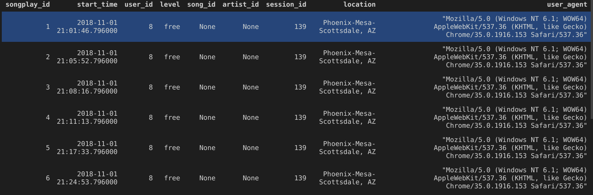

# About the project

This project was built as part of *Data Modeling with Postgres* by **Udacity** - Data Engineering NanoDegree. 

In this project we simulate and build an ETL pipeline using Python for a fictitious startup called Sparkify.

We've defined fact and dimension tables for a star schema for a particular analytic focus, and wrote an ETL pipeline that transfers data from files (JSON) in two local directories into these tables in Postgres using Python and SQL.

The dataset has information related to songs, artists and users, which will result in our final tables in Postgres, 1 fact (songplay) and 4 Dimensions (users, artists, songs and time).

 ## Built with

 - Python
 - PostgreSQL
 - SQL

 # Getting Started

 ## Prerequisites

 To run the project, you need PostgreSQL 12.6 installed and configured into your local machine. user: student, password: student, dbname: studentdb, must also be created first before running the scripts.

 A database called sparkifydb will be created automatically during the process.

## Installation

Python 3.* must be installed in order to run the scripts.

Inside the folder that contains **requirements.txt**, please run the following command to install necessary python packages:

```
pip3 install -r requirements.txt
```

# Usage

First run the file create_tables.py to create Sparkifydb and drop tables each time you want to rerun the program and load data into brand new tables.

the ETL pipeline is done by running etl.py.

To run both scripts simply execute:

```
python3 create_tables.py
```


```
python3 etl.py
```

Before running etl.py again remember to always run create_tables.py to drop current populated tables.

The jupyter notebooks *etl.ipynb* and *test.ipynb* are intended to test if the table was correctly populated and to develop functionalities for etl.py.

The file sql_queries.py contains all SQL queries that will be executed in etl.py.

# Result

After running etl.py, you should have a final fact table with the following structure:

